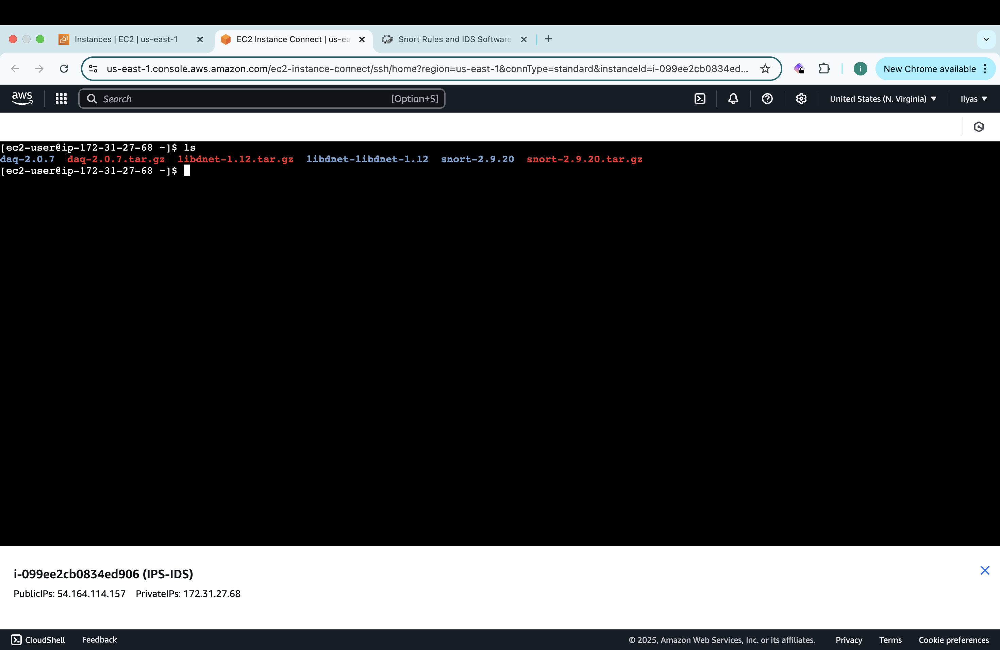

# Snort Installation Guide on Amazon Linux 2
---

## Prerequisites
1. Launch an Amazon Linux 2 EC2 instance.
   - **Instance Type**: t2.micro or larger
   - **Security Group**:
     - Allow SSH (port 22) for remote access
2. Connect to the instance using SSH.

--- 

## Step 1: Update the System
Run the following command to ensure the system is up-to-date:
```bash
sudo yum update -y
```

## Step 2: Install Required Dependencies
nstall all the necessary tools and libraries for building and running Snort. This includes compilers and dependencies that will be needed throughout the installation process:
```bash
sudo yum install -y gcc gcc-c++ libpcap libpcap-devel pcre pcre-devel bison flex zlib zlib-devel make wget
```

## Step 3: Download Snort
Download the Snort source code from the official Snort website:
```bash
cd ~  # Ensure we're in home directory
wget https://www.snort.org/downloads/snort/snort-2.9.20.tar.gz
```

## Step 4: Extract the Downloaded Archive
```bash 
tar -xvzf snort-2.9.20.tar.gz
cd snort-2.9.20
``` 


## Step 5: Install Libdnet
The libdnet library is required by Snort for low-level networking functionality. If it's missing, Snort will not compile. Follow these steps to install libdnet:
First, return to the home directory to start the libdnet installation:
```bash
cd ~
```
1. Download libdnet source code:
```bash 
wget https://github.com/dugsong/libdnet/archive/refs/tags/libdnet-1.12.tar.gz -O libdnet-1.12.tar.gz
```
2. Extract the archive:
```bash
tar -xvzf libdnet-1.12.tar.gz
cd libdnet-libdnet-1.12
```
3. Configure and build libdnet:

Why Configure?
The ./configure command prepares libdnet to work on your specific system. It checks if all required tools and libraries are available and sets everything up for the building process. Think of it as customizing the library for your computer.
Why Build?
The make command compiles the source code into a usable library. This step translates the human-readable code into machine code that your system can run.
```bash
./configure
make
sudo make install
```
4. Update the library cache: This lets the system know where to find the newly installed library:
```bash
sudo ldconfig
```


## Step 6: Install DAQ Library
First, return to the home directory to start the DAQ installation:
```bash
cd ~
``` 
The DAQ (Data Acquisition) library is required by Snort to process network packets. Follow these steps to install it:

1. Download the DAQ source code:
```bash 
wget https://www.snort.org/downloads/snort/daq-2.0.7.tar.gz
```
2. Extract DAQ archive:
```bash
tar -xvzf daq-2.0.7.tar.gz
cd daq-2.0.7
```
3. Configure the DAQ Library:
You should be inside the DAQ directory.
```bash
./configure
``` 
4. Build and install the DAQ library:
```bash
make
sudo make install
``` 


## Step 7: Configure and Build Snort
1. Navigate to the Snort directory from home:
```bash 
cd ~/snort-2.9.20
```
2. Configure without OpenAppID which will skip the requirement to download another library (not needed for this simulation):
```bash
./configure --disable-open-appid
```
3. Build Snort source code:
```bash
make
```
4. Install Snort: 
```bash
sudo make install
```
5. Verify Installation: 
```bash
snort --version
``` 


## Step 8: Create Configuration  Directories 
Creating configuration directories ensures Snort has a structured place to store rules, logs, and dynamic modules for smooth operation.

1. Run the following commands to set up the directories for Snort’s configuration and logs:
```bash 
sudo mkdir -p /etc/snort/rules  
sudo mkdir /var/log/snort   #Where logs generated by snort will be installed
sudo mkdir /usr/local/lib/snort_dynamicrules #Where Dynamic Rules will be installed (helps detect certain types of traffic)
``` 


2. Copy Default Configuration File:
Snort has default configuration files when installed located in the directory where it was downloaded.
This is the main configuration file for snort. We are just moving this file to the directory we created "/etc/snort/rules" so it is easier to manage configurations. 
```bash 
sudo cp ~/snort-2.9.20/etc/* /etc/snort/
```
Verify this step using:
```bash 
ls -l /etc/snort
```


## Step 9: Customise snort.conf file. 
The snort.conf file is the main configuration file for Snort. Customizing it ensures Snort monitors the correct network, uses the right rules, and stores logs appropriately.

1. Open the configuration file: 
```bash
sudo nano /etc/snort/snort.conf
```


2. Set the HOME_NET variable:
The HOME_NET variable defines the network or host you want Snort to protect. For this simulation, its the private IP of my EC2 instance. 
Locate the line ipvar HOME_NET any and replace "any" with your private ip. 


3. Update Paths for rules and logs:
These paths guide Snort to the correct locations for rules and logs. Without these changes, Snort won’t function properly during the simulation. We created these specific directories to organize and structure Snort’s configurations, ensuring it operates smoothly during your simulation.

Find the paths and replace them with: 
```bash
var RULE_PATH /etc/snort/rules
var SO_RULE_PATH /usr/local/lib/snort_dynamicrules
var PREPROC_RULE_PATH /etc/snort/rules

```


Save changes using Ctrl + O and exit using Ctrl + X

5. Creat Custome rules in the local.rules file: 
We edit local.rules to define custom detection rules specific to the traffic we want to monitor in this IDS simulation.
Open the local.rules file: 
```bash 
sudo nano /etc/snort/rules/local.rules
```
Add this simple custom rule to detect ICMP traffic:
```bash 
alert icmp any any -> $HOME_NET any (msg:"ICMP Traffic Detected"; sid:1000001; rev:1;)
``` 


(You may have to comment out all include rules and whitelist/blacklist sections except the local.rules, look at configs directory) 
 
## Step 10 Test snort (you will need to find the full path)
```bash
sudo /usr/local/bin/snort -A console -q -c /etc/snort/snort.conf -i eth0
```

